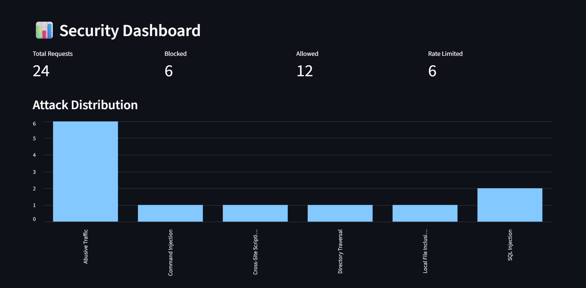
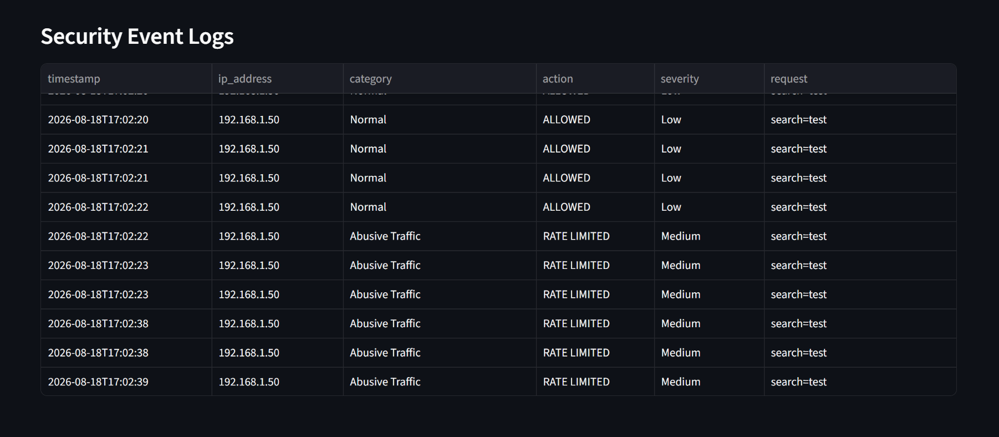
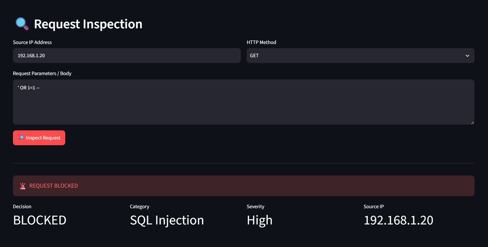
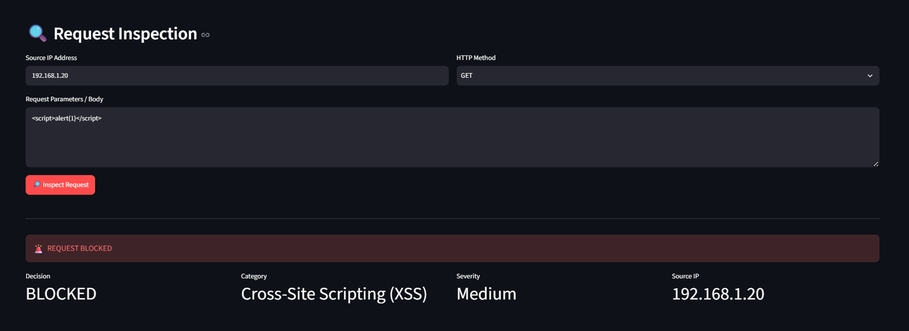
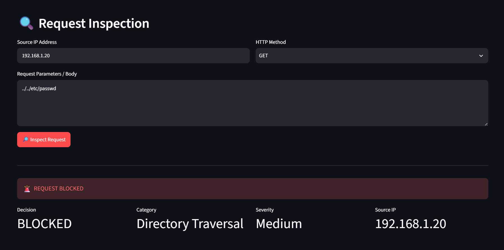
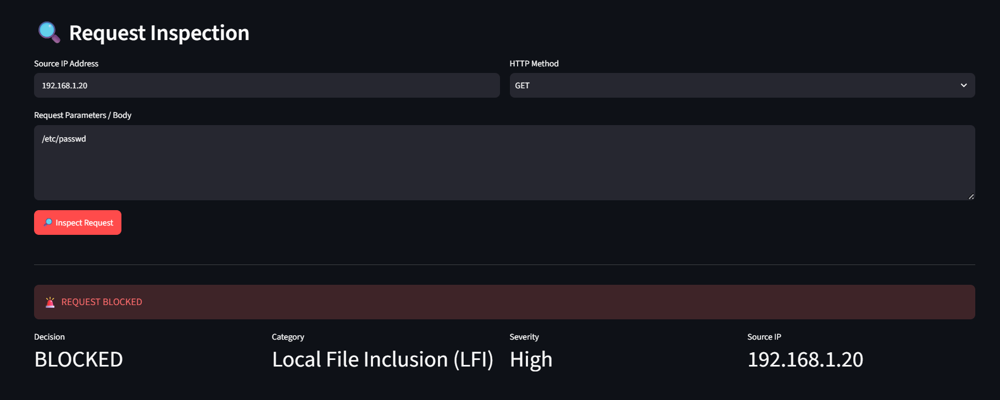
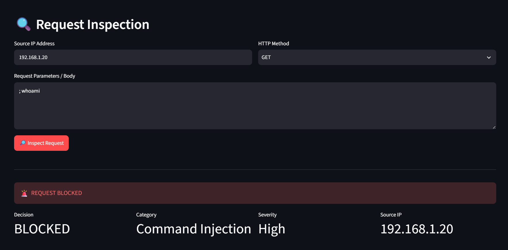
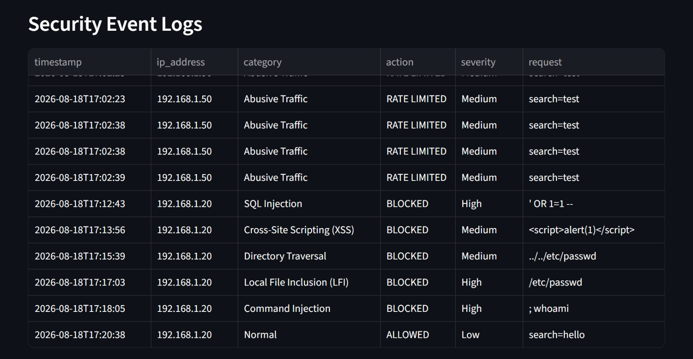

# 🛡️ SentinelShield

## Advanced Intrusion Detection & Web Protection System

SentinelShield is a lightweight **Web Application Firewall (WAF) and Intrusion Detection System (IDS) simulator** developed for cybersecurity practical training and security monitoring.

The application inspects HTTP-style request data, detects common web attack patterns, monitors repeated traffic from source IP addresses, applies allow/block decisions, records security events, and presents security insights through an interactive Streamlit dashboard.

> **Project purpose:** Defensive cybersecurity education and controlled testing only. The detector analyzes submitted test strings and does not execute attack payloads.

---

## 🚀 Key Features

- 🔍 HTTP-style request inspection
- 💉 SQL Injection detection
- 🧪 Cross-Site Scripting (XSS) detection
- 📁 Directory Traversal detection
- 📄 Local File Inclusion (LFI) detection
- 💻 Command Injection pattern detection
- 🚦 IP-based rate limiting and abusive traffic detection
- 🛡️ Allow / Block / Rate-Limited decision engine
- 📝 Security event logging with timestamps and source IPs
- ⚠️ Severity classification
- 📊 Attack distribution dashboard
- 📋 Security event log visualization
- 📈 Request and attack statistics

---

## 🏗️ System Architecture

```text
                    ┌─────────────────────┐
                    │   HTTP-style Input  │
                    │ URL / Params / Body │
                    └──────────┬──────────┘
                               │
                               ▼
                    ┌─────────────────────┐
                    │  Request Inspection │
                    └──────────┬──────────┘
                               │
                 ┌─────────────┴─────────────┐
                 │                           │
                 ▼                           ▼
        ┌──────────────────┐       ┌──────────────────┐
        │  Detection Rules │       │   Rate Limiter   │
        │ SQLi / XSS / LFI │       │ IP + Time Window │
        │ Traversal / CMDi │       │ Abuse Detection  │
        └────────┬─────────┘       └────────┬─────────┘
                 │                           │
                 └─────────────┬─────────────┘
                               ▼
                    ┌─────────────────────┐
                    │   Decision Engine   │
                    │ ALLOW / BLOCK / RL  │
                    └──────────┬──────────┘
                               │
                               ▼
                    ┌─────────────────────┐
                    │   Security Logger   │
                    │ Timestamp / IP /    │
                    │ Category / Severity │
                    └──────────┬──────────┘
                               │
                               ▼
                    ┌─────────────────────┐
                    │ Security Dashboard  │
                    │ Charts / Metrics /  │
                    │ Event Logs          │
                    └─────────────────────┘
```

### Request Processing Flow

```text
Request
  ↓
Inspect input
  ↓
Match security signatures
  ↓
Check request frequency
  ↓
Make security decision
  ↓
Log event
  ↓
Display dashboard result
```

---

## 🔍 Detection Categories

| Detection Type | Purpose | Example Indicator |
|---|---|---|
| SQL Injection | Identifies common SQL manipulation patterns | `OR 1=1`, `UNION SELECT` |
| Cross-Site Scripting (XSS) | Identifies script and event-handler patterns | `<script>`, `javascript:` |
| Directory Traversal | Detects path traversal sequences | `../` |
| Local File Inclusion (LFI) | Detects local file reference patterns | `/etc/passwd` |
| Command Injection | Detects common command chaining patterns | `; whoami` |
| Abusive Traffic | Detects excessive requests from an IP | Request threshold exceeded |

---

## ⚙️ Technology Stack

- **Python** — Application and detection logic
- **Streamlit** — Interactive security dashboard
- **Pandas** — Event and statistics handling
- **Plotly / Streamlit Charts** — Security visualization
- **Regular Expressions** — Signature-based threat detection
- **JSON** — Lightweight security event storage
- **IP-based Rate Limiting** — Repeated traffic monitoring

---

## 📂 Project Structure

```text
SentinelShield/
│
├── app.py                         # Streamlit dashboard and request workflow
├── detector.py                    # Threat detection engine
├── logger.py                      # Security event logging
├── rate_limiter.py                # IP-based request rate limiting
├── rules.py                       # Detection signatures and rule definitions
├── requirements.txt               # Python dependencies
├── README.md                      # Project documentation
├── .gitignore                     # Files excluded from Git
│
├── data/
│   └── security_events.json       # Generated security events
│
└── screenshots/
    ├── 01_security_dashboard.png
    ├── 02_rate_limiting.png
    ├── 03_sql_injection.png
    ├── 04_xss_detection.png
    ├── 05_directory_traversal.png
    ├── 06_lfi_detection.png
    ├── 07_command_injection.png
    └── 08_security_logs.png
```

---

## ▶️ Local Installation

### 1. Clone the repository

```bash
git clone https://github.com/YOUR-USERNAME/SentinelShield.git
cd SentinelShield
```

### 2. Create a virtual environment

**Windows:**

```powershell
python -m venv venv
venv\Scripts\activate
```

**Linux / macOS:**

```bash
python -m venv venv
source venv/bin/activate
```

### 3. Install dependencies

```bash
pip install -r requirements.txt
```

### 4. Run the application

```bash
streamlit run app.py
```

Open the local application at:

```text
http://localhost:8501
```

---

## 🧪 Security Testing Performed

The project was tested with controlled request strings representing common web attack categories and normal traffic.

| Test Case | Expected Result | Status |
|---|---|---|
| Normal request | ALLOWED | ✅ Tested |
| SQL Injection | BLOCKED | ✅ Tested |
| Cross-Site Scripting (XSS) | BLOCKED | ✅ Tested |
| Directory Traversal | BLOCKED | ✅ Tested |
| Local File Inclusion (LFI) | BLOCKED | ✅ Tested |
| Command Injection | BLOCKED | ✅ Tested |
| Repeated traffic | RATE LIMITED | ✅ Tested |

### Security Event Fields

Each logged event contains:

- Timestamp
- Source IP address
- Detection category
- Security action
- Severity
- Submitted request data

---

## 📊 Dashboard Results

SentinelShield provides an interactive dashboard containing:

- Total requests
- Blocked requests
- Allowed requests
- Rate-limited requests
- Attack category distribution
- Security event logs
- Source IP information
- Severity information

---

## 📸 Project Screenshots

### 1. Security Dashboard



Overview of request statistics, blocked/allowed traffic, attack distribution, and security event logs.

### 2. Rate Limiting



Demonstrates repeated-request monitoring and rate-limit enforcement for a source IP.

### 3. SQL Injection Detection



Shows SentinelShield identifying a SQL Injection test pattern and blocking the request.

### 4. XSS Detection



Shows detection of a Cross-Site Scripting test pattern.

### 5. Directory Traversal Detection



Shows detection and blocking of a directory traversal test string.

### 6. Local File Inclusion Detection



Shows detection of a local file inclusion test pattern.

### 7. Command Injection Detection



Shows detection and blocking of a command injection test pattern.

### 8. Security Event Logs



Shows recorded security events with timestamp, IP, category, action, severity, and request information.

---

## 🛡️ Security Approach

SentinelShield uses a **rule-based detection model** combined with **IP-based rate limiting**.

1. A request is submitted through the dashboard.
2. The input is inspected against predefined security signatures.
3. The source IP is checked against the request-rate threshold.
4. A decision is generated: **ALLOW**, **BLOCK**, or **RATE LIMITED**.
5. The event is stored in `data/security_events.json`.
6. The dashboard updates the security metrics and event table.

This approach demonstrates the core defensive workflow:

```text
Detection → Decision → Logging → Alerting → Dashboarding
```

---

## 🎯 Practical Objectives Covered

- HTTP request inspection
- Attack signature identification
- Rule-based threat detection
- Behavior monitoring
- IP-based rate limiting
- Security log analysis
- Dashboard interpretation
- Detection and response workflow
- Security event reporting
- Practical testing and evidence collection

---

## 📈 Future Improvements

Possible extensions for a production-oriented version include:

- Machine-learning-assisted anomaly detection
- Persistent database storage
- Real HTTP reverse-proxy integration
- Authentication and role-based access control
- Configurable rule management
- GeoIP and ASN enrichment
- SIEM integration
- Email / webhook alerting
- Advanced request/header analysis
- Historical time-series reporting
- Automated security test generation

---

## ⚠️ Disclaimer

SentinelShield is an educational defensive-security project intended for controlled environments. The application performs pattern-based inspection of submitted test data and is not intended to replace a production WAF, IDS, IPS, or SIEM platform.

---

## Author

Developed as a cybersecurity internship project.